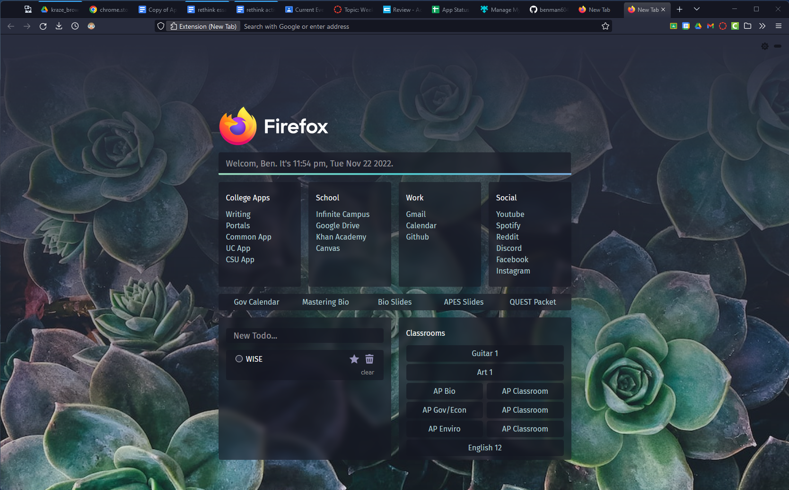
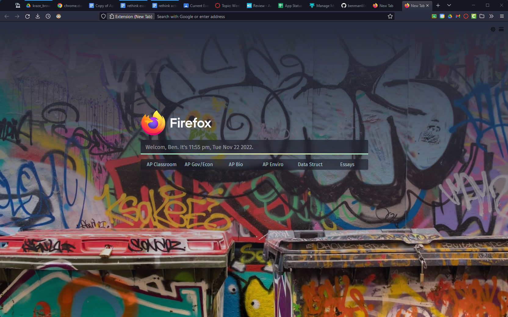

Custom newtab for Firefox built with Svelte.





### Features
- Synced todo list
- Dynamic background image
- Smart search bar
    - `y query` for Youtube, `d query` for Google Drive, etc.


## Getting started
Install dependencies:
```sh
cd svelteapp
npm install
```

Set up development environment
```sh
npm run dev
```

Or build for deployment
```sh
npm run build
```
- Once built, navigate to ```svelteapp/dist/index.html```
- Remove the ```/``` in front of the ```src``` in the ```script``` and the ```href``` in the ```link```